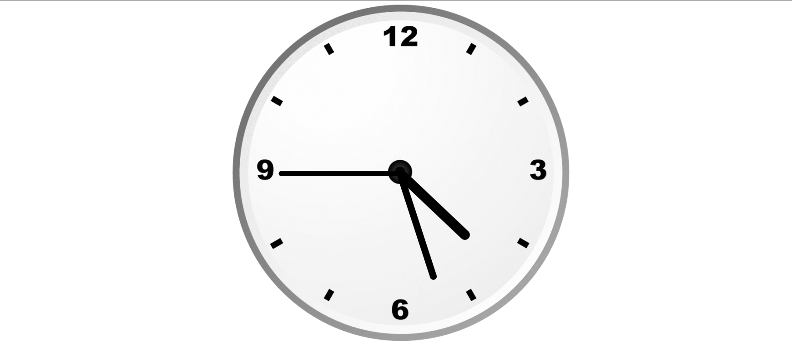

# 🕒 Analog Clock

A simple and responsive Analog Clock built using HTML, CSS, and JavaScript. The clock updates in real-time by using JavaScript to calculate and rotate the hour, minute, and second hands according to the current system time.

## 🚀 Live Demo

🔗 https://codewithshubz.github.io/analog-clock/

## 📂 GitHub Repository

🔗 https://github.com/CodeWithShubz/analog-clock

---

## 📖 About The Project

This project was created as a practice project to understand:

* JavaScript Date Object
* DOM Manipulation
* CSS Transform & Rotation
* Real-Time UI Updates
* Basic Frontend Development

The clock automatically synchronizes with the system time and updates every second.

---

## ✨ Features

* 🕒 Real-time analog clock
* ⚡ Smooth hand movement
* 📱 Responsive design
* 🎨 Clean user interface
* 🚀 Hosted using GitHub Pages

---

## 🛠️ Technologies Used

* HTML5
* CSS3
* JavaScript

---

## 📸 Screenshot



---

## 📁 Project Structure

```text
analog-clock/
│
├── clock.png
├── index.html
├── style.css
├── script.js
└── README.md
```

---

## ⚙️ How It Works

The clock uses JavaScript's `Date()` object to get the current:

* Hours
* Minutes
* Seconds

These values are converted into rotation angles and applied to the clock hands using CSS transforms.

Example:

```javascript
const d = new Date();
let htime = d.getHours();
let mtime = d.getMinutes();
let stime = d.getSeconds();
```

The hands are then rotated dynamically:

```javascript
hour.style.transform = `rotate(${hrotation}deg)`;
minute.style.transform = `rotate(${mrotation}deg)`;
second.style.transform = `rotate(${srotation}deg)`;
```

---

## ▶️ Run Locally

Clone the repository:

```bash
git clone https://github.com/CodeWithShubz/analog-clock.git
```

Open:

```text
index.html
```

in your browser.

No additional installation is required.

---

## 🎯 Learning Outcomes

Through this project, I learned:

* JavaScript fundamentals
* DOM manipulation
* Working with Date and Time
* CSS transforms and positioning
* Building real-time web applications

---

## 👨‍💻 Author

**Shubham Tivrekar**

GitHub: https://github.com/CodeWithShubz

---

## ⭐ Note

This project was created for educational and practice purposes to improve frontend development skills.
